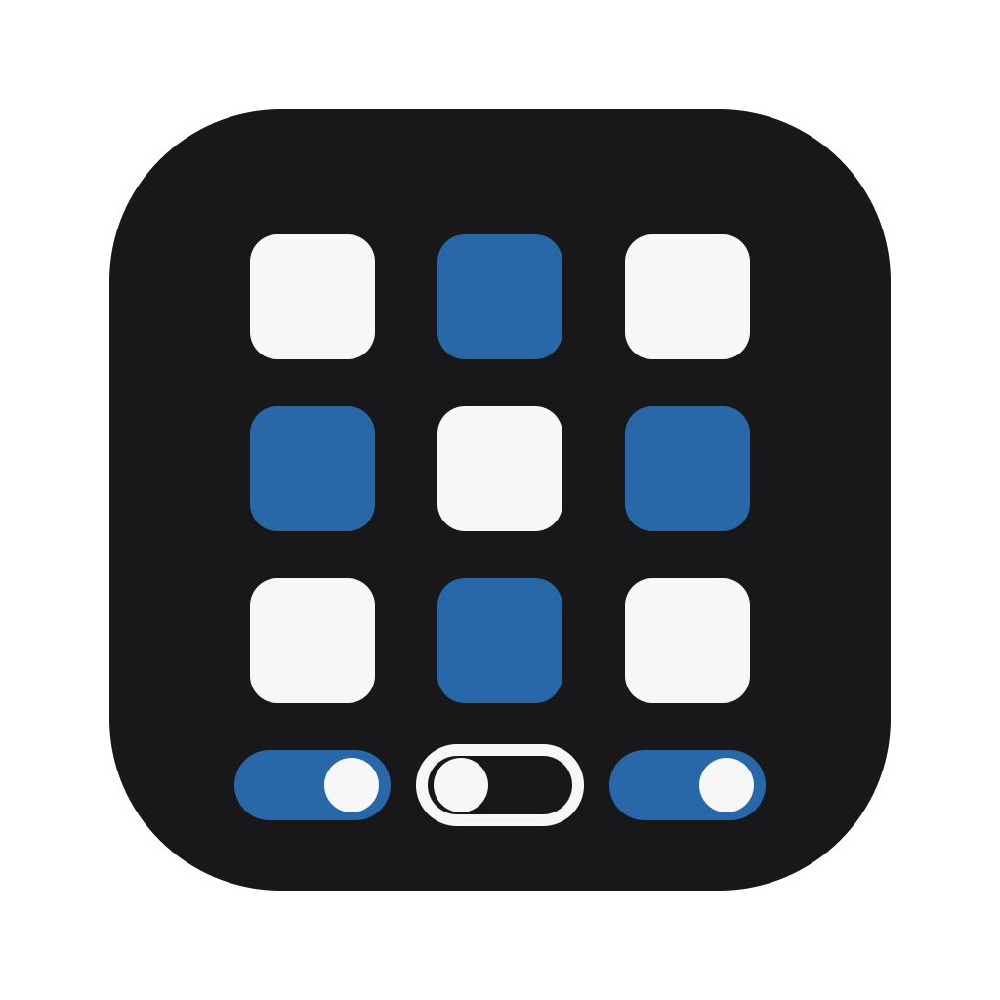

<p align="center">
  
</p>

# Skill Session Profiles

[简体中文](README.zh-CN.md)

A macOS app and Codex plugin for managing global skill defaults, reusable
profiles, and the persistent configuration used by subsequently opened Codex
tasks.

## Features

- Browse installed Codex skills and filter them by name or source.
- Enable or disable all skills in the current filtered result.
- Save reusable profiles containing explicit per-skill overrides.
- Apply a profile on top of global defaults for subsequently opened tasks.
- Edit global skill defaults through the Codex App Server contract.
- Switch between Chinese and English, light and dark themes.
- Share profile data between the standalone app and Codex plugin.

## How It Works

The standalone Electron app and MCP panel use the same backend and data store.
Configuration writes go through Codex App Server APIs; the project does not
edit `~/.codex/config.toml` directly.

User data is stored locally at:

```text
~/.codex/skill-session-profiles
```

The app currently targets macOS on Apple Silicon. Builds are unsigned and not
notarized.

## Requirements

- macOS on Apple Silicon
- Node.js 22.22.2
- Codex CLI installed and available in `PATH`

## Development

```bash
npm ci
npm run desktop
```

Useful commands:

```bash
npm run build
npm test
npm run test:e2e
npm run test:electron
npm run dist:mac
```

`test:electron` launches the real desktop app and requires a working local
Codex installation. The GitHub CI workflow runs the portable build, unit, and
browser E2E checks.

## Build Artifacts

```bash
npm run dist:mac
```

The `.app` bundle and DMG are written to `output/`. Release artifacts are not
committed to the repository.

## Plugin Development

The plugin entry point is `.codex-plugin/plugin.json`. The bundled MCP server,
hook, panel, and skill live in `.mcp.json`, `hooks/`, `src/`, and `skills/`.

After changing plugin code, build the project before installing the plugin so
that `dist/server/index.js` and the bundled panel are current.

## Security

Please report vulnerabilities through GitHub's private security advisory
feature. See [SECURITY.md](SECURITY.md).

## Contributing

Contributions are welcome. Read [CONTRIBUTING.md](CONTRIBUTING.md) and the
[Code of Conduct](CODE_OF_CONDUCT.md) before opening a pull request.

## License

Licensed under the [MIT License](LICENSE).
